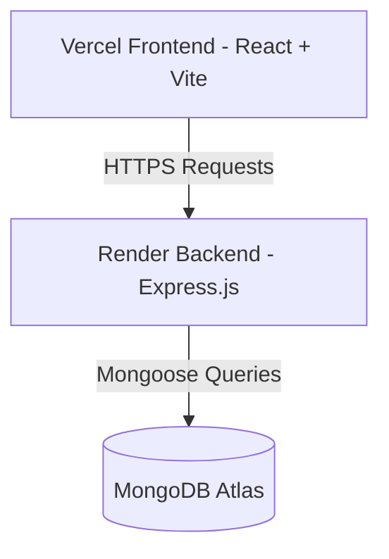

# Zovryn Dashboard

Zovryn Dashboard is a modern, responsive full-stack admin dashboard application. It provides an intuitive interface for managing users, monitoring real-time orders, tracking revenue, and analyzing product performance. The app is split into a **Vite + React** frontend and a **Node.js + Express + MongoDB** backend.

---

## 🚀 Key Features

* **Interactive Overview**: Dynamic graphs tracking sales, revenue, order stats, and active customer growth.
* **Product Management**: Create, read, update, and delete (CRUD) product listings with automatic low-stock alerting.
* **User Management**: Admin controls for searching users, updating profiles, changing statuses, and updating security details.
* **Notification System**: User-specific alerts for new orders, low stock warning alerts, system messages, and more.
* **Secured Architecture**: Strictly enforced JWT authentication, robust request encryption/helmet protection, and isolated CORS configurations.

---

## 🛠️ Architecture & Tech Stack



### Frontend
* **Core**: React, Vite
* **Styling**: Tailwind CSS
* **Icons**: Iconify

### Backend
* **Runtime & Framework**: Node.js, Express.js
* **Database**: MongoDB (via Mongoose)
* **Security**: Helmet, CORS, BCryptJS (Password hashing), JWT (JSON Web Tokens)

---

## 📦 Project Directory Structure

```text
├── backend/                  # Node.js + Express API
│   ├── config/               # Database connection config
│   ├── controllers/          # Business logic controllers
│   ├── middleware/           # Auth and error handling middlewares
│   ├── models/               # MongoDB models (User, Product, Order, etc.)
│   ├── routes/               # Express API endpoints
│   ├── seed/                 # Seed script for initial setup database
│   ├── server.js             # API entrypoint
│   └── .env.example          # Environment variable template
│
└── frontend/                 # React SPA
    ├── src/
    │   ├── assets/           # Media and image files
    │   ├── App.jsx           # Core Dashboard Single Page Application
    │   └── main.jsx          # Entrypoint
    └── vite.config.js        # Vite configurations
```

---

## ⚙️ Local Development Setup

### 1. Prerequisites
Make sure you have [Node.js](https://nodejs.org/) installed (v16+ recommended) and a running instance of MongoDB (or a MongoDB Atlas connection URI).

### 2. Backend Configuration
1. Navigate to the `backend/` directory:
   ```bash
   cd backend
   ```
2. Install the backend dependencies:
   ```bash
   npm install
   ```
3. Create a `.env` file based on `.env.example`:
   ```bash
   cp .env.example .env
   ```
4. Update the environment variables in `.env` with your port, database connection, JWT secret, and CORS settings:
   ```env
   PORT=5000
   NODE_ENV=development
   MONGODB_URI=mongodb://localhost:27017/zovryn-db
   JWT_SECRET=your-development-secret-key
   JWT_EXPIRE=7d
   ALLOWED_ORIGINS=http://localhost:5173,http://localhost:3000
   ```
5. *(Optional)* Seed the database with mock orders, products, notifications, and users:
   ```bash
   npm run seed
   ```
6. Start the development server:
   ```bash
   npm run dev
   ```

### 3. Frontend Configuration
1. Navigate to the `frontend/` directory:
   ```bash
   cd ../frontend
   ```
2. Install dependencies:
   ```bash
   npm install
   ```
3. Start the Vite development server:
   ```bash
   npm run dev
   ```
4. Access the application in your browser at the default Vite address (usually `http://localhost:5173`).

---

## 🛡️ Production Deployment Guide

### Frontend Deployment (Vercel)
1. Import the repository into your **Vercel** dashboard.
2. Set the **Root Directory** to `frontend`.
3. Configure the environment variable:
   * `VITE_API_URL`: Your deployed Render backend URL (e.g., `https://api.yourdomain.com`).
4. Click **Deploy**.

### Backend Deployment (Render)
1. Create a new **Web Service** on Render and link this repository.
2. Set the **Root Directory** to `backend`.
3. Configure environment variables in the Render console:
   * `NODE_ENV`: `production`
   * `MONGODB_URI`: *Your Production MongoDB connection string*
   * `JWT_SECRET`: *A secure random secret key*
   * `ALLOWED_ORIGINS`: *Your deployed Vercel Frontend URL* (e.g., `https://your-app.vercel.app`)
4. Deploy the service.
